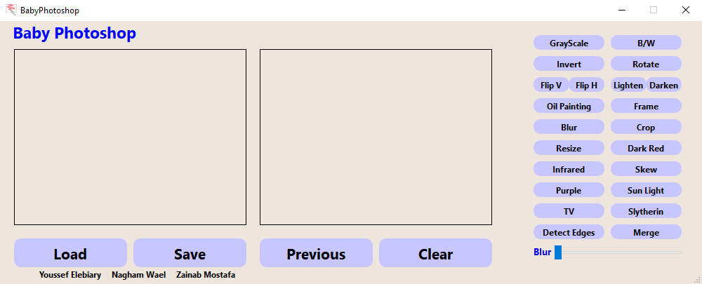

# PhotoWizard  

## Purpose
___
This a GUI application that can edit images and apply filters to them  
For the console based version [click here](https://github.com/YoussefElebiary/BabyPhotoshop)   

**NOTE : During the live preview, the image may seem out-of-ratio/size, to view it in the correct ratio/size save it and open it externally**

## Authors
___
[Youssef Ahmed Mahmoud Mohamed Elebiary](https://github.com/YoussefElebiary)    -    20231208 
[Nagham Wael Mohamed](https://github.com/NaghamProgrammer)    -    20231189 
[Zainab Mostafa Mohammad Mahmoud Ali](https://github.com/z18409)       -    20231071  

## Features
___
PhotoWizard supports all the following features:
* Applying multiple filters to the same image  
* Live preview of the applied filters  
* Removing all the applied filters to the image  
* Undoing the last applied filter only  
* Supports multiple intensities of blurring  
* Supports adding a frame with all the possible color combinations   

## Filters
___
Grayscale   -   Black and White   -   Invert   -   Rotate   -   Flip  
Lighten and Darken   -   Oil   -   Frame   -   Blur   -   Crop  
Resize   -   Dark Red   -   Infrared   -   Skew   -   Purple  
Sunlight   -   TV   -   Slytherin   -   Detect Edges   -   Merge   

## Installation
___
You can install the prebuilt version found in the release folder  

To install and build PhotoWizard manually follow these steps:
* Make sure you have Qt 6.6.0 at least  
* Make sure you have Qt Creator 13.0.0 at least  
* Download all the files and place them in the same folder  
* Open the project using Qt Creator  
    * File  
    * Open File or Project  
    * Select the .pro file  
* To build and run PhotoWizard click the run button (Ctrl+R)   

## Version
___
1.0